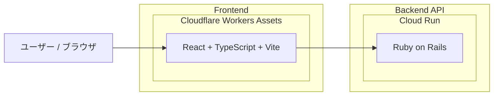

# masusono-blog

このリポジトリは `backend` と `frontend` の2ディレクトリ構成です。

## アーキテクチャ図



## ディレクトリ構成

- `backend`: Rails API
- `frontend`: React + TypeScript + Vite
- `edge-api-worker`: Cloudflare Worker (Cloud Run API のプロキシ用)

## Frontend

```bash
cd frontend
npm ci
npm start
```

### 用語定義

- 本プロジェクトで「アプリ」は、`frontend/src/features/apps` 配下の個別ミニアプリを指します（例: `NumbersApp`, `MasudaRunApp`）。
- `frontend/src/app` はフロントエンド全体の初期化と構成を担う層であり、上記の「アプリ」とは区別します。

### API接続先

`frontend/src/constants.ts` で固定管理しています。

- 開発環境: `http://localhost:3000`
- ステージング環境・本番環境: `https://api.masusono.com`
- APIパスは明示的に `.json` を付けます（例: `/articles.json`, `/metrics.json`, `/shops.json`, `/podcasts.json`）。

### Import パス規約

- `frontend/src` 配下の import は原則 `@/...` を使います。
- 同一ディレクトリ内の参照のみ `./...` を使います。
- `../...` の相対 import は原則使いません。

### ディレクトリ運用方針

- 現在の共通設定は `frontend/src/constants.ts` を利用します。
- 新しいトップレベルディレクトリは、用途を `README` または `frontend/docs` に明記してから追加します。
- 詳細なフロントエンド開発規約は `frontend/docs/development-conventions.md` を参照してください。

### `frontend/src` の責務分割（2026-02-08時点）

- `src/main.tsx`: DOMマウントのみを担当。
- `src/app`: アプリ初期化と全体構成（`RootApp`, `App`, `AppLayout`, `AppRoutes`）。
- `src/pages`: ルート単位の薄い画面ラッパー（featureのページ実装を合成）。
- `src/features`: 機能単位の実装。
- `src/shared`: ドメイン非依存の共通実装。

### Phase 4 の整理結果（2026-02-08更新）

- 旧トップレベルの `src/components` / `src/hooks` / `src/types` は撤去。
- アプリ全体レイアウト部品は `src/app/ui` に配置（`Header`, `Footer`, `ScrollRestoration`）。
- ページメタ用 hook は `src/shared/hooks/usePageMeta.ts` に配置。
- 数値アプリ専用の hook / 型は `src/features/apps/numbers/hooks` と `src/features/apps/numbers/model` に配置。

### `src/features` の現行内訳（Phase 3 更新）

- `src/features/home/ui`: ホーム固有 UI（`HomePage`, `HomeHero`, `HomeAppLaunchers`, `HomeFeatureLinks`, `UechanBirthdaySection`）。
- `src/features/shops`: 推し店ドメイン実装（`model/shop`, `hooks/useShops`, `ui/ShopsPage`）。
- `src/features/apps/ui`: apps横断のランチャーUI（`AppsDrawerLauncher`）。
- `src/features/apps/masudaRun` / `src/features/apps/numbers`: 各アプリ固有実装。

### `src/shared` の現行内訳

- `src/shared/api`: 共通 API ヘルパー（`fetchJson`）。
- `src/shared/lib`: 共通ユーティリティ（`sx` のマージ処理）。
- `src/shared/ui`: 汎用 UI（`PageContainer`, `ContentCard`, `ContentCardSkeleton`）。
- `src/shared/navigation`: ルーティング依存の共通 UI（`FeatureLinkCard`）。

### Import 境界ルール

- `src/pages` / `src/features` / `src/shared` から `src/app` を import しません。
- 旧パス（例: `@/utils/fetchJson`, `@/utils/sx`, `@/components/PageContainer`）は使用しません。
- 上記は `frontend/biome.json` の `style.noRestrictedImports` で lint 強制しています。

### テスト / ビルド

```bash
cd frontend
npm test
npm run build
```

### Cloudflare Workers へのデプロイ

```bash
cd frontend
npx wrangler deploy
```

## Backend

バックエンドのセットアップと実行方法は `backend/README.md` を参照してください。

## Edge API Worker

`api.masusono.com` を Worker 経由で運用する場合は `edge-api-worker/README.md` を参照してください。
