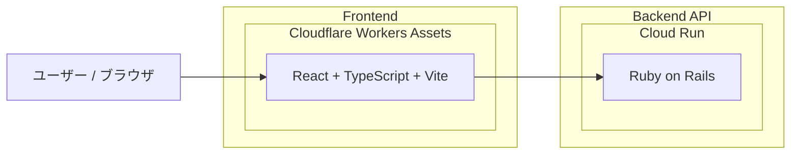

# masusono-blog

このリポジトリは `backend` と `frontend` の2ディレクトリ構成です。

## アーキテクチャ図



## ディレクトリ構成

- `backend`: Rails API
- `frontend`: React + TypeScript + Vite

## Frontend

```bash
cd frontend
npm ci
npm start
```

### API接続先

`frontend/src/constants.ts` で固定管理しています。

- 開発環境: `http://localhost:3000`
- ステージング環境・本番環境: `https://api.masusono.com`
- APIパスは明示的に `.json` を付けます（例: `/articles.json`, `/metrics.json`, `/shops.json`, `/podcasts.json`）。

### Import パス規約

- `frontend/src` 配下の import は原則 `@/...` を使います。
- 同一ディレクトリ内の参照のみ `./...` を使います。
- `../...` の相対 import は原則使いません。

### ディレクトリ運用方針

- 現在の共通設定は `frontend/src/constants.ts` を利用します。
- 新しいトップレベルディレクトリは、用途を `README` または `frontend/docs` に明記してから追加します。
- 詳細なフロントエンド開発規約は `frontend/docs/development-conventions.md` を参照してください。

### テスト / ビルド

```bash
cd frontend
npm test
npm run build
```

### Cloudflare Workers へのデプロイ

```bash
cd frontend
npx wrangler deploy
```

## Backend

バックエンドのセットアップと実行方法は `backend/README.md` を参照してください。
