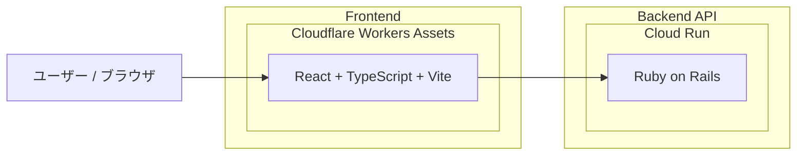

# masusono-blog

このリポジトリは `backend` と `frontend` の2ディレクトリ構成です。

## アーキテクチャ図



## ディレクトリ構成

- `backend`: Rails API
- `frontend`: React + TypeScript + Vite

## Frontend

```bash
cd frontend
npm ci
npm start
```

### API接続先

`frontend/src/constants.ts` で固定管理しています。

- 開発環境: `http://localhost:3000`
- ステージング環境・本番環境: `https://api.masusono.com`

### テスト / ビルド

```bash
cd frontend
npm test
npm run build
```

### Cloudflare Workers へのデプロイ

```bash
cd frontend
npx wrangler deploy
```

## Backend

バックエンドのセットアップと実行方法は `backend/README.md` を参照してください。
