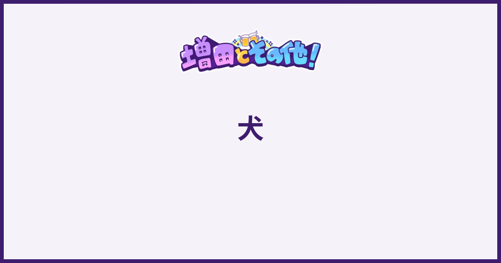
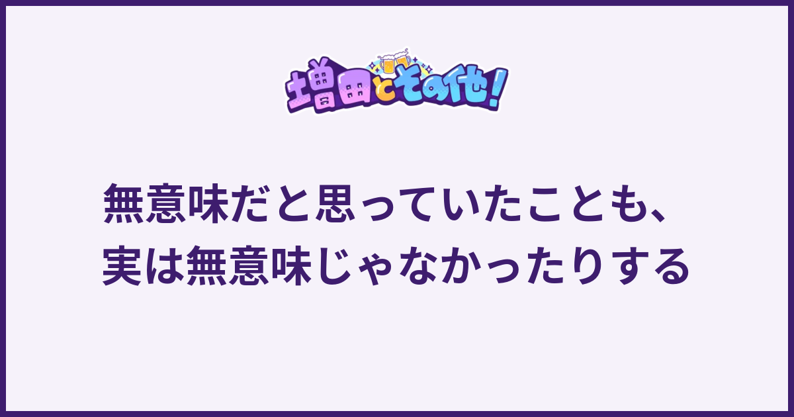
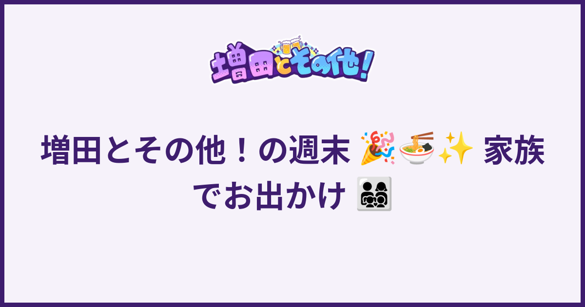
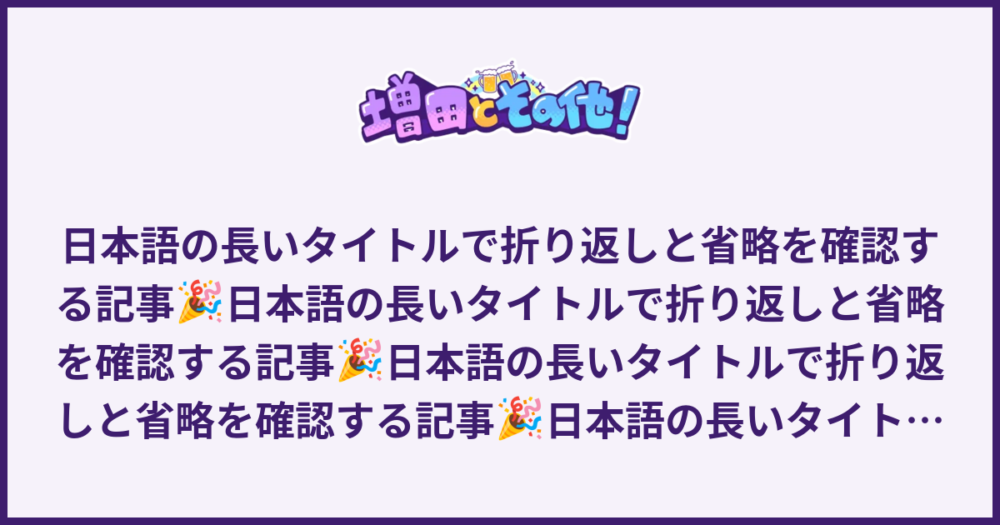

# 記事のOGP画像

公開記事の詳細ページだけに `og:image` / `twitter:image` をSSRで出力する。
画像URLは `https://masusono.com/articles/:article_id/ogp/:version.png`。
記事一覧・本文には画像を追加せず、CMS項目・アップロードも不要。

## 描画

1200×630 PNG。背景は #F6F2FA、外周に #3E1D6E の8px枠線を描く。ロゴは既存の
`app/frontend/assets/logo.webp`（「増田とその他！」の白枠付きロゴ）を
上端64pxの位置に幅360px以内・縦横比保持で、画像の横中央に配置する。
記事タイトルは #3E1D6E、Noto Sans CJK JP Bold、幅1072pxの領域（左端64px・上端256px）内で中央揃えに描画。
1行に収まらない場合は句読点（、。！？!?）の後で改行した配置を優先する。
連続する句読点や閉じ括弧は前のまとまりに残す。「！の」のように感嘆符・
疑問符の後が助詞につながる場合は区切らない。句読点区切りが最大4行・
高さ310pxに収まらない場合は、全文表示を優先して通常の折り返しを使う。
64pxから48pxまで縮小して最大4行・高さ310pxに収め、超過時だけ
書記素単位で末尾を「…」にする。Pangoで日本語禁則・折返し・絵文字の
フォントフォールバックを処理し、CMS本文やタイトルは変更しない。

DockerfileにはImageMagick/Pango、日本語Noto CJKとNoto Color Emojiを含める。
ホストでRailsを動かす場合も同じツール・フォントとGNU `timeout` が必要。
レンダラーはシェルを介さず引数配列で呼び、タイトルのマークアップをエスケープする。
各画像処理は15秒で打ち切る。

## キャッシュ・公開状態

ID・元タイトル・`ArticleOgpImage::TEMPLATE_VERSION` のSHA-256からURL版を決める。
ロゴ、配置、フォント、描画依存の変更時はテンプレート版も更新する。
PNGはRails.cacheに7日保存する（本番は既存のSolid Cache）。
記事取得は毎回公開用microCMS APIで行う。draftKeyを使わず、画像キャッシュより
先に公開状態を検証する。未公開・存在しない記事は404、CMS障害時は503。
旧版URLは現在の公開記事の新版へ307を返す。
HTTPはno-storeとし、配信キャッシュに非公開化前の画像を残さない。
共有サービスが既に取り込んだカードの削除・即時更新までは保証しない。

描画失敗時は事前生成済みの `public/ogp-fallback.png` を返す。
フォールバックは記事版のキャッシュへ保存せず次回再試行する。
共通PNGは背景と既存ロゴだけなのでレンダラー自体の障害でも配信できる。
ロゴやテンプレートの変更時は共通PNGも同じ環境で再生成する。

worktreeルートでの共通PNG再生成：

```bash
.codex/skills/masusono-worktree/scripts/compose.sh run --rm --no-deps backend \
  convert -size 1200x630 'xc:#F6F2FA' \
  '(' app/frontend/assets/logo.webp -resize '360x180>' ')' \
  -geometry +420+64 -composite \
  -fill none -stroke '#3E1D6E' -strokewidth 8 -draw 'rectangle 4,4 1195,625' \
  -strip PNG32:public/ogp-fallback.png
```

## 検証

request specでPNGの寸法、認証不要、旧版URL、非公開・不在、CMS障害を確認する。
service specで日本語・長文・絵文字、版変更、キャッシュ、共通PNGを確認する。
SSRテストと全画面Visual RegressionでJavaScriptなしの初期HTMLと画像取得を確認する。
共有サービスでの実カード確認には本番への明示的なデプロイ依頼が必要。

## プレビュー（テンプレート3）

2026-10-07の公開RSSから取得した実在タイトル2件と、検証用タイトルを同じ描画環境で生成。

- [犬](https://masusono.com/articles/z72aggss5bmy)：64,442 bytes
- [無意味だと思っていたことも、実は無意味じゃなかったりする](https://masusono.com/articles/g2skm_wrbxs)：109,485 bytes
- 絵文字・ZWJ家族絵文字の検証：114,072 bytes
- 超長文の48px・4行・末尾「…」の検証：176,474 bytes






初期HTML・画像HTTP取得はローカルの公開記事fixtureで検証する。
本番デプロイおよびX等の実カード表示は未確認。既存ロゴの見た目と文言は確認済み。
